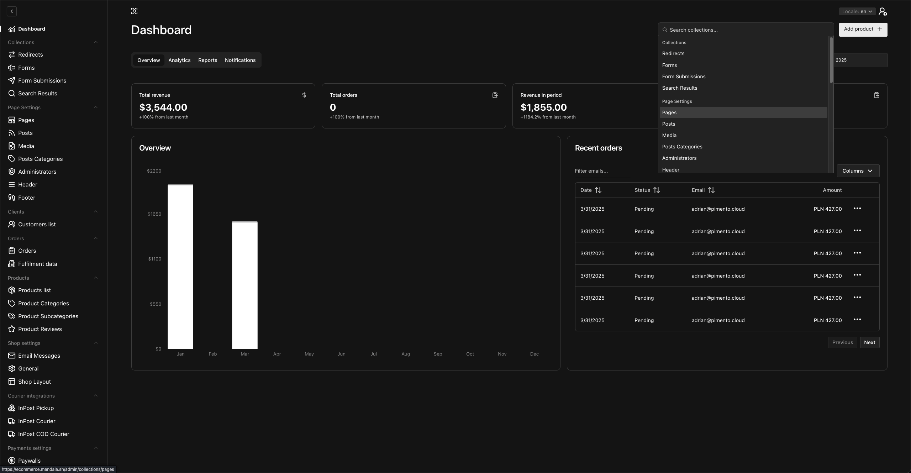

# Payload Ecommerce Template

A modern ecommerce storefront powered by Payload and Next.js. This template provides all the essential features to build and manage a beautiful online store.

## 🌐 Live demo

You can access the live demo of the template at [https://ecommerce.mandala.sh/en](https://ecommerce.mandala.sh/en).

## ✨ Features

- **Modern Storefront**: A beautiful and fast storefront built with Next.js and Tailwind CSS.
- **Powerful Admin Panel**: Manage your products, orders, and customers with the powerful Payload admin UI.
- **Product Management**: Easily add and manage products with variants (size, color, etc.).
- **Shopping Cart & Checkout**: A complete and secure checkout flow.
- **User Accounts**: Customers can create accounts to view their order history and manage their profiles.
- **SEO Friendly**: Pre-configured for search engine optimization.
- **Multi-language**: Supports multiple languages out of the box.
- **Payments and Shipping**: Supports payments and shipping out of the box.
- **Customizable**: Easily extend and customize the design and functionality to fit your brand.

## 📸 Screenshots

- **Example storefront**
  

- **Admin panel Dashboard**
  

## 🚀 Getting Started

Follow these steps to get your ecommerce store up and running on your local machine.

### Installation & Setup

1.  **Clone the repository:**

    ```bash
    git clone https://github.com/Mandala-Software-House/payload-ecommerce-template.git
    cd payload-ecommerce
    ```

2.  **Install dependencies:**

    ```bash
    pnpm install
    ```

3.  **Set up environment variables:**

    Copy the example environment file. If `.env.example` does not exist, create a new file named `.env`.

    ```bash
    cp .env.example .env
    ```

    Now, open the `.env` file and fill in the required variables, especially your `MONGODB_URI` and `PAYLOAD_SECRET`.

4.  **Run the development server:**

    ```bash
    pnpm dev
    ```

5.  **Access your store:**
    - Your website will be available at [http://localhost:3000](http://localhost:3000)
    - The Payload admin panel will be at [http://localhost:3000/admin](http://localhost:3000/admin)

    When you first visit the admin panel, you will be prompted to create your first admin user.

## Usage

- **Managing Products**: Go to the `/admin` panel, navigate to the 'Products' collection to add, edit, or remove products.
- **Viewing Orders**: Customer orders will appear in the 'Orders' collection in the admin panel.
- **Customizing Pages**: You can edit pages like 'About Us' or create new ones using the 'Pages' collection.

Feel free to explore the admin panel to discover all the features!
